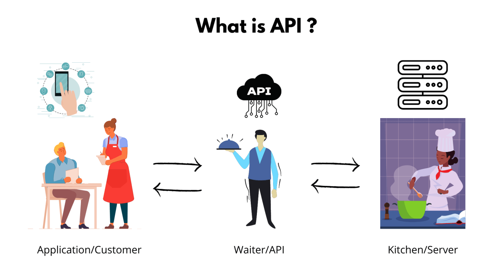

#### What is Server?
A server is a computer or system that provides resources, data, services, or programs to other computers (clients) over a network.

#### What is node.js?
Its a library of js. A server side javascript runtime, not a programming language.

#### Run backend:
1. npm init -y > package.json > scripts > "start": "node index.js"
2. npm i express cors
3. index.js > follow express js documentation
4. nodemon index.js

#### post data:
1. create a post api on the server side
2. client side send data via post
3. set fetch method inside the fetch options (second parameter)
4. options will have three things: method, headers, body
    - headers: 'content-type': 'application/json'
    - don't forget to send data by JSON.Stringify in the body
5. On the server side: don't forget to use express.json() middleware