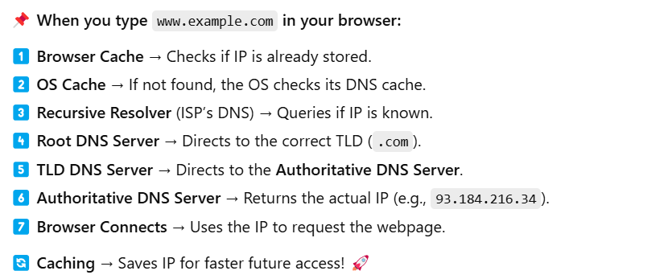

## Internet
- human access information online through domain name
- web browser interact though internet protocol addresses

<b>IP address:</b> a unique address that identifies a device and website on the internet or a local network

<b>DNS:</b> domain name system is the phone-book of internet. it translates domain names to ip addresses. so browsers can load internet resources.

<b>Small Flow of DNS Resolution:</b> 
