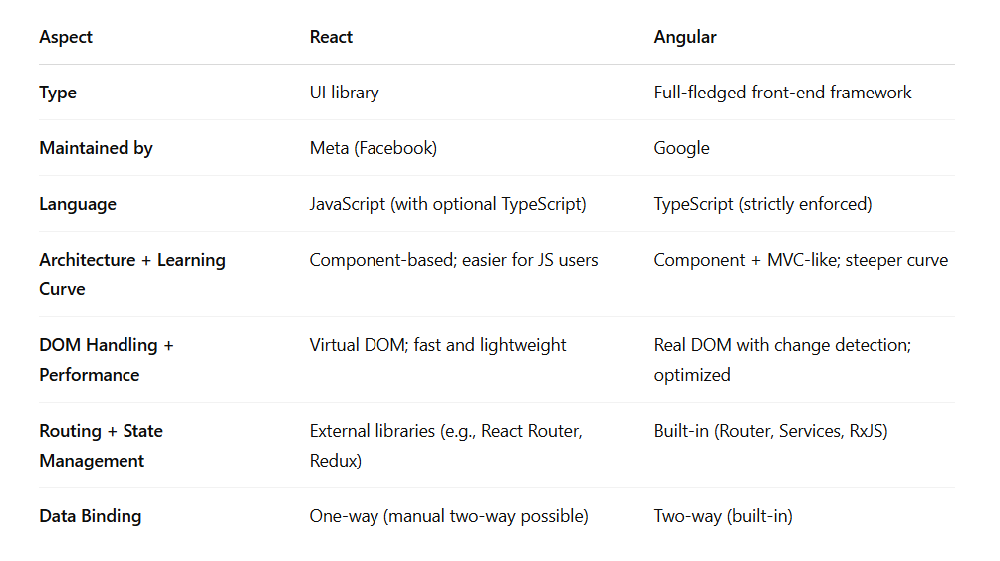

## React
- a js library used for building user interfaces ~ by Meta

1. component-based architecture
    - UI is broken down into reusable components (like building blocks)
    - each component manages its own logic and rendering
2. virtual dom 
    - used to update only the parts of UI that have changed, making it very fast
3. jsx (js xml) 
    - a syntax extension that lets you write html inside js
4. unidirectional data flow
5. hooks - useState, useEffect, etc

### React vs Angular
- react gives u more freedom and u choose ur tools and libraries - lego blocks
- angular is opinionated and comes with everything included - u follow its structure  

### Component
A <b>react component</b> is a js function or class that returns <b>jsx</b> (html-like code) to render part of the UI. Like a <b>custom html tag</b> that builds part of a webpage
- always capitalize component names, because react treats lowercase tags as html elements.
- component flow: parent to child
- file names are capitalized too (by convention)
- on + Event (onClick, ...)