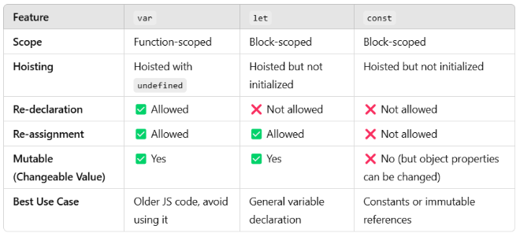

# Programming Hero Batch 9

## Assignment's Live Link:
- [A1 - New Year New Mission](https://maysha-khanom-moon.github.io/ph-a1-new-year-new-mission/) ~ html + vanilla css (not responsive)

- [A2 - Trek Twig](https://maysha-khanom-moon.github.io/ph__a2__trek-twig/) ~ html + vanilla css (not responsive)

- [A3 - Hockey](https://maysha-khanom-moon.github.io/ph__a3__hockey/) ~ html + tailwind css + daisyui (responsive)

<br>

### Course outline
0. Milestone 0: Introductory
1. Milestone 1: Html, css, and github as a beginner
2. Milestone 2: Responsive web layout
3. Milestone 3: Css frameworks
4. Milestone 4: Hello javascript
5. Milestone 5: Integrate javascript (js in a relation)
6. Milestone 6: Intermediate javascript, api
7. Milestone 7: Introduction to simple react
8. Milestone 8: React router and state management
9. Milestone 9: React authentication
10. Milestone 10: Backend and database integrate
11. Milestone 11: Backend with jwt and axios interceptor

<br>

## Useful Links
- [Free images and resources collection for website](https://medium.com/design-bootcamp/free-images-and-resources-collection-for-website-c77f2fc46ce5)

<br>

## Interview Questions:
1. what do you understand by the universal selector?
- It selects all elements on a webpage.

<br>

2. differentiate between the use of id selector and class selector?
- ID (#id): Unique, applies to one element.
- Class (.class): Reusable, applies to multiple elements.

<br>

3. how can you use css to control image repetition?
- Use background-repeat (e.g., no-repeat, repeat-x, repeat-y).

<br>

4. are the html tags and elements the same thing?
- Tags: Markup symbols (```<p> </p>```)
- Elements: Includes tags and content (```<p>Hello</p>```)

<br>

5. difference between inline, block, and inline-block elements. is it possible to change an inline element into a block-level element?
- Inline: No new line, width as content (```<span>```). And height doesn't work here.
```
<a> <b> <strong> <i> <em> <u> <span>  <br> 
<input> <label> <mark> 
<small> <sub> <sup> 
<code> <time>
```

- Block: Full width, starts on a new line (```<div>```).
```
    <div>
    <p> 
    <heading_tags> 
    <list_tags>
    <table_tags> 
    <form> 
    <section> <article> 
    <header> <footer>
```
- Inline-Block: Behaves like inline but allows setting width/height.
- Changing Inline to Block: Use ```display: block;``` in CSS.

<br>
<br>

6. What is Git? What are the advantages of using Git?
- <b>Git</b> is a distributed version control system that tracks changes in source code.
- Advantages:
    - Distributed system (works offline).
    - Branching and merging support.
    - Fast and efficient.
    - Secure and reliable.

<br>

7. What do you understand by the term ‘Version Control System’?
- A Version Control System (VCS) is a tool that tracks changes in files, allowing collaboration, history tracking, and rollback to previous versions.

<br>

8. What’s the difference between Git and GitHub?
- <b>Git</b> is a version control system that manages code changes locally.
- <b>GitHub</b> is a cloud-based hosting service for Git repositories, enabling collaboration and remote access.

9. Name a few Git commands with their function
- git init → Initialize a new repository.
- git clone ```<repo>``` → Clone a repository.
- git add ```<file>``` → Stage changes.
- git commit -m "message" → Save changes.
- git push → Upload changes to a remote repo.
- git pull → Fetch and merge changes from remote.

10. Difference between git fetch and git pull
- Use git fetch if you just want to check updates first.
- Use git pull if you want to get updates directly.

<br>

11. Grid vs Flex
- <b>What?</b> Grid is for 2D layouts (rows & columns), Flex is for 1D layouts (row or column).
- <b>When?</b> Use Grid for complex layouts, Flex for simple alignment.
<b>Why?</b> Grid provides precise control, Flex is more flexible for dynamic content.

12. Media Query
- A CSS rule to make websites responsive. it adjust styles based on screen size and ensures a good user experience on all devices. 🚀

## Basic 
- <b>Semantic tags:</b> provide meaning to the content, improving accessibility and SEO.
    - header, nav, section, article, aside, footer, main, em, figure, figcaption

- <b>Git</b> is a <b>distributed</b> version control system because every developer has a full copy of the entire repository, including its history, allowing them to work independently without relying on a central server

### html vs html5
<b>HTML5</b> is an upgraded, feature-rich version of HTML with better multimedia, form controls, and responsiveness. Also <b>better semantics & SEO</b>


<b>Flash</b> was a multimedia software platform developed by <b>Adobe</b> for creating animations, interactive content, and web applications. It was widely used for videos, games, and rich media content on websites. Flash relied on a browser plugin (Adobe Flash Player) to run. <br>
<b>End of Flash:</b> Adobe officially discontinued Flash on December 31, 2020. 🚫

<br>

### CSS vs CSS3
<b>CSS3</b> is an upgraded version of CSS with modular improvements, advanced selectors (before only id, class, element), responsive design (@media queries), animations (@keyframes, transition), and modern layout techniques (Flexbox, Grid). It also introduces enhanced styling features like border-radius, box-shadow, and custom fonts (@font-face). These enhancements make web design more efficient, responsive, and visually appealing while reducing reliance on images and JavaScript.

### order of specificity: 
1. Inline styles
2. ```!important``` rules
3. ID selector
4. Class selectors, attribute selectors, pseudo-classes
5. Element (tag) selectors
6. Universal selector (*)
7. Order of appearance (bottom --> latest)

### 5 things for responsiveness
1. Break points
2. Media query
3. style changes
4. image fluid
5. relative measuring units and Testing!

### tailwind css
- highly flexible, utility-first css framework
- it is <b>mobile-first</b> means styles are applied to smaller screens by default.
- it has various component libraries (e.g., Flowbite, DaisyUI, etc).

### library vs framework
- <b>library:</b> Like a toolbox—you pick and use the tools as needed.
- <b>framework:</b> Like a blueprint—you build according to the predefined structure.

<br>

## JS
### var vs let vs const

A <b>block</b> in JavaScript is a set of statements <b>enclosed in curly braces {}</b>. (if, for, while, and functions) <br>
A <b>function-scoped</b> variable means it is only accessible inside the function where it is declared. <br>
If declared outside a function, it becomes a <b>global variable</b>.

### substring vs slice in string


### primitive vs non-primitive data types


<br>

### DOM manipulation
- DOM (Document Object Model) Manipulation refers to the process of dynamically changing the content, structure, and style of a webpage using JavaScript. The DOM represents an <b>HTML document as a tree structure</b> where each element is a node, allowing JavaScript to interact with and modify it in real-time
- when webpage loaded, HTML document converted into DOM Tree

### Array vs Array-like object
- <b>array:</b> a data structure that stores multiple values of the same type in a contiguous memory location and provides built-in methods for manipulation.
- <b>array-like object:</b> an object that has indexed elements and a length property but lacks array methods like .map(), .push(), or .filter()

### NodeList vs HTMLCollection

- <b>Static NodeList:</b> does not update when the DOM changes. It remains a snapshot of the elements at the time of selection.
- <b>Live HTMLCollection:</b> automatically updates when the DOM changes (e.g., new elements added or removed)